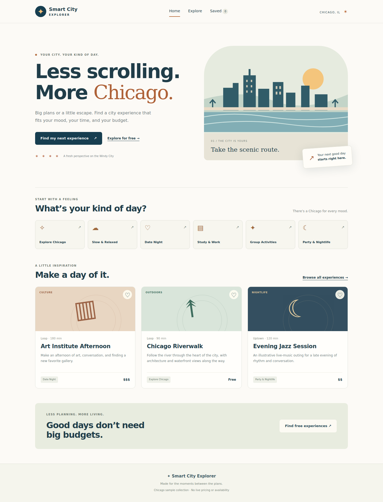

# Smart City Explorer

**Find your kind of Chicago.**

A full-stack city discovery app that helps people turn a mood, a budget, and a little free time into a plan. Browse a curated sample collection, narrow it down to your kind of day, and save experiences to revisit later.



## What you can do

- Discover experiences across six moods, from focused study sessions to date nights.
- Combine keyword, category, neighborhood, budget, and duration filters.
- Sort by name, budget, or visit duration, and share the filtered URL.
- Open an experience detail page and save or remove favorites.
- Keep saved experiences across reloads and synchronize them across tabs in the same browser.
- Explore a clearly labeled demo collection when the backend is unavailable.
- Use the interface on desktop or mobile, with labeled controls, keyboard focus states, a skip link, and reduced-motion support.

**Data note:** The 12 bundled experiences are sample ideas. Some describe real Chicago places; others are explicitly illustrative outings. Prices, durations, and suitability are not live or verified venue information. This app does not provide bookings, live events, or personalized AI recommendations.

[Explore view](docs/screenshots/explore-desktop.png) · [Mobile view](docs/screenshots/home-mobile.png)

## Technology

| Layer | Stack |
| --- | --- |
| Interface | React, TypeScript, React Router, Vite |
| API | Java 17+, Spring Boot 3.5, Spring MVC, Bean Validation |
| Data | Spring Data JPA, H2; configurable MySQL connection |
| Tests | Vitest, Testing Library, JUnit, Spring Boot MockMvc |
| Delivery | GitHub Actions, Docker, Nginx |

## Run locally

Requirements: **Node.js 24 LTS**, **Java 17 or newer**, and **Maven 3.9+**. Run commands from the repository root unless indicated otherwise.

Start the API in one terminal:

```bash
mvn -f backend/pom.xml spring-boot:run
```

Start the interface in a second terminal:

```bash
cd frontend
npm ci
npm run dev
```

Open **http://localhost:5173**. Vite proxies `/api` to **http://localhost:8080**. No database installation, API key, or account is required. To preview only the interface, run just the frontend; a visible demo-mode notice appears when the API cannot be reached.

### Docker option

```bash
docker compose up --build
```

Open **http://localhost:3000**. The frontend container proxies API requests to the backend container. The default H2 catalog resets on backend restart.

### Configuration

| Variable | Default | Purpose |
| --- | --- | --- |
| `PORT` | `8080` | API port |
| `DB_URL` | In-memory H2 | JDBC connection URL |
| `DB_USERNAME` | `sa` | Database username |
| `DB_PASSWORD` | Empty | Database password |
| `DB_DDL_AUTO` | `update` | Hibernate schema behavior for local development |
| `SEED_ENABLED` | `true` | Seed sample data when the database is empty |
| `CORS_ALLOWED_ORIGINS` | `http://localhost:5173,http://localhost:4173` | Comma-separated allowed browser origins |
| `VITE_API_URL` | `/api` | Frontend build-time API base URL |

For MySQL, create a database and set `DB_URL=jdbc:mysql://localhost:3306/smart_city_explorer` along with its credentials. Backend values must be exported in your shell or supplied by your hosting service; Spring does not automatically load a root `.env` file. The optional frontend `.env.local` file follows Vite conventions; see `frontend/.env.example`. Never put secrets in `VITE_*` variables, which are bundled into browser code.

## Validate

```bash
# API integration tests and executable JAR
mvn -B -ntp -f backend/pom.xml verify

# Frontend behavior tests, type checking, and production bundle
cd frontend
npm ci
npm test
npm run build
```

GitHub Actions runs both check groups on pushes to `main` and on pull requests. Dependencies are pinned in the frontend manifest and lockfile; Dependabot checks monthly for updates.

## Project structure

```text
backend/         Spring Boot API, persistence, validation, integration tests
frontend/        React application, browser storage, discovery UI, tests
shared/          One sample catalog used by both applications
docs/            API contract, architecture decisions, screenshots
.github/         CI workflow and dependency update configuration
compose.yaml     Local two-container setup
```

Read the [API reference](docs/API.md) and [architecture decisions](docs/ARCHITECTURE.md) for request examples, data flow, and tradeoffs.

## Scope and next steps

Favorites currently live in the browser. The catalog is small and unpaginated, and H2 is ephemeral by default. Next steps include account-backed collections, paginated server-side discovery, database migrations, verified venue data, and accessibility testing with assistive technology. These are planned improvements, not implemented features.

## Author

Built by [Khushi Shah](https://github.com/KhushiShah-swe).
